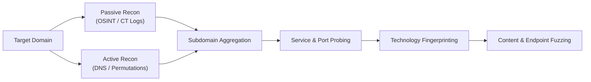
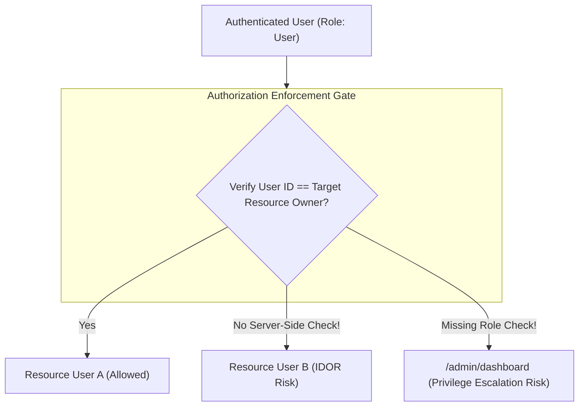
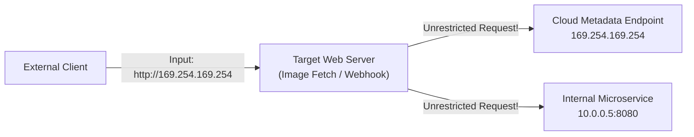

# Comprehensive Web Application Penetration Testing Methodology & Field Guide

> **Standard Alignment**: OWASP Web Security Testing Guide (WSTG v4.2), OWASP Top 10 (2021), PTES (Penetration Testing Execution Standard), NIST SP 800-115.

---

## Table of Contents

1. [Phase 1: Pre-Engagement & Scoping](#phase-1-pre-engagement--scoping)
2. [Phase 2: Reconnaissance & Attack Surface Mapping](#phase-2-reconnaissance--attack-surface-mapping)
   - [2.1 Passive OSINT & Domain Intelligence](#21-passive-osint--domain-intelligence)
   - [2.2 Subdomain Enumeration (Passive & Active)](#22-subdomain-enumeration-passive--active)
   - [2.3 Subdomain Takeover Detection](#23-subdomain-takeover-detection)
   - [2.4 Technology Stack Fingerprinting](#24-technology-stack-fingerprinting)
   - [2.5 Content & Hidden Endpoint Discovery](#25-content--hidden-endpoint-discovery)
3. [Phase 3: Network & Transport Security Assessment](#phase-3-network--transport-security-assessment)
4. [Phase 4: OWASP Top 10 (2021) Web Application Testing](#phase-4-owasp-top-10-2021-web-application-testing)
   - [A01: Broken Access Control](#a012021--broken-access-control)
   - [A02: Cryptographic Failures](#a022021--cryptographic-failures)
   - [A03: Injection](#a032021--injection)
   - [A04: Insecure Design](#a042021--insecure-design)
   - [A05: Security Misconfiguration](#a052021--security-misconfiguration)
   - [A06: Vulnerable and Outdated Components](#a062021--vulnerable-and-outdated-components)
   - [A07: Identification and Authentication Failures](#a072021--identification-and-authentication-failures)
   - [A08: Software and Data Integrity Failures](#a082021--software-and-data-integrity-failures)
   - [A09: Security Logging and Monitoring Failures](#a092021--security-logging-and-monitoring-failures)
   - [A10: Server-Side Request Forgery (SSRF)](#a102021--server-side-request-forgery-ssrf)
5. [Phase 5: API Security Assessment (REST & GraphQL)](#phase-5-api-security-assessment-rest--graphql)
6. [Phase 6: Reporting, Remediation & Verification](#phase-6-reporting-remediation--verification)

---

## Phase 1: Pre-Engagement & Scoping

Before any active packet is transmitted, legal and operational guardrails must be established.

### 1.1 Rules of Engagement (RoE) & Authorization
- **Purpose**: Prevent legal liability, establish authorized testing windows, identify sensitive production assets, and define communication protocols.
- **Key Actions**:
  - Secure signed **Statement of Work (SOW)** and formal **Written Authorization**.
  - Document emergency contacts (CISO, Lead SysAdmin, SOC Lead).
  - Define escalation triggers (e.g., immediate notification upon discovering critical RCE or database compromise).
  - Clarify testing constraints: Denial of Service (DoS/DDoS) exclusions, social engineering boundaries, and third-party SaaS boundaries.

### 1.2 Scope Boundaries & Cloud Policies
- **Target Delineation**: Specific Fully Qualified Domain Names (FQDNs), CIDR IP ranges, and API endpoints.
- **Cloud Compliance**: Check testing policies for AWS, Azure, GCP, or DigitalOcean to ensure test boundaries respect multi-tenant cloud service terms.

---

## Phase 2: Reconnaissance & Attack Surface Mapping

Reconnaissance maps the target's external footprint to find forgotten assets, staging servers, and unmaintained entry points.

### 2.1 Passive OSINT & Domain Intelligence
- **Purpose**: Discover publicly indexed organizational assets without sending anomalous traffic directly to target networks.
- **Methodology**:
  - Query Autonomous System Numbers (ASN) and WHOIS records to identify netblocks owned by the target organization.
  - Search public threat-intelligence registries, historical DNS caches, and internet-wide scanning search engines.
- **Common Tools**:
  - `WHOIS / ASN Lookup`: Identifies IP allocations and registration ownership.
  - `Shodan / Censys`: Passive querying of pre-indexed listening ports, banners, and TLS certificates.
  - `Wayback Machine / AlienVault OTX`: Historical URLs, parameter archives, and historical subdomains.

### 2.2 Subdomain Enumeration (Passive & Active)
- **Purpose**: Uncover staging environments (`staging.example.com`), developer portals (`dev-api.example.com`), legacy systems, and internal admin panels.
- **Methodology**:
  - **Passive CT Logs**: Query public Certificate Transparency (CT) logs to find every domain issued a public TLS certificate.
  - **Active DNS Brute-forcing**: Resolve combinations of common subdomain names against high-speed authoritative nameservers.
  - **DNS Permutation / Alteration**: Generate word combinations (e.g., `api-dev`, `api-test`, `v2-api`) based on discovered roots.
  - **Zone Transfer (AXFR)**: Check whether authoritative DNS servers inadvertently allow unauthenticated zone transfers.
- **Common Tools**:
  - `Amass` (OWASP): In-depth network mapping and asset discovery engine combining active and passive sources.
  - `Subfinder`: Fast, passive-only subdomain discovery tool aggregating 40+ OSINT sources.
  - `crt.sh`: Web interface and JSON API for querying Certificate Transparency logs.
  - `MassDNS`: High-throughput DNS stub resolver capable of resolving millions of records per minute.
  - `DNSx`: Multi-purpose DNS toolkit for running DNS queries and filtering wildcards.

### 2.3 Subdomain Takeover Detection
- **Purpose**: Detect DNS records (`CNAME`, `ALIAS`, `A`) pointing to decommissioned or unclaimed third-party cloud services (AWS S3, GitHub Pages, Heroku, Azure, Zendesk).
- **Methodology**:
  - Identify CNAME records resolving to non-existent cloud endpoints (returning `NXDOMAIN` or service-specific 404 claiming pages).
  - Verify whether an attacker could register the abandoned service name to claim control of the subdomain.
- **Common Tools**:
  - `can-i-take-over-xyz`: Community repository documenting vulnerable services, fingerprint signatures, and risk status.
  - `Subzy`: Subdomain takeover vulnerability checker targeting known cloud service signatures.

### 2.4 Technology Stack Fingerprinting
- **Purpose**: Map out web servers, operating systems, reverse proxies, content management systems (CMS), and client-side JavaScript frameworks.
- **Methodology**:
  - Analyze HTTP response headers (`Server`, `X-Powered-By`, `X-AspNet-Version`).
  - Examine cookie structures (e.g., `PHPSESSID`, `JSESSIONID`, `csrftoken`).
  - Inspect HTML DOM comments, script bundle file paths, and favicon cryptographic hashes (`mmh3`).
- **Common Tools**:
  - `Wappalyzer`: Browser extension and CLI utility for identifying technology stacks.
  - `WhatWeb`: Next-generation web scanner for fingerprinting platforms, CMS versions, and embedded scripts.
  - `httpx`: Probing utility to extract HTTP titles, status codes, technology headers, and TLS fingerprints (JA3/JA4).

### 2.5 Content & Hidden Endpoint Discovery
- **Purpose**: Locate unlinked pages, backup files, configuration leaks, and administrative dashboards.
- **Methodology**:
  - Examine metadata files: `/robots.txt`, `/sitemap.xml`, `/.well-known/security.txt`.
  - Check for exposed version control systems: `/.git/`, `/.svn/`.
  - Check for backup and environment artifacts: `/.env`, `/config.json.bak`, `/dump.sql`.
  - Wordlist-based content discovery (directory and parameter fuzzing).
- **Common Tools**:
  - `ffuf` (Fuzz Faster U Fool): High-performance web fuzzer written in Go for paths, parameters, and virtual hosts.
  - `Feroxbuster`: Recursive content discovery tool built in Rust with auto-filtering capabilities.
  - `Gobuster`: Lightweight URI and directory brute-forcer written in Go.
  - `SecLists`: Curated collection of wordlists (usernames, passwords, directories, discovery paths).

---

## Phase 3: Network & Transport Security Assessment

Validates that supporting host services, open ports, and cryptographic protocols adhere to security hardening baselines.

### 3.1 Port Scanning & Service Identification
- **Purpose**: Identify listening ports and verify that only expected web ports (e.g., 80, 443) are publicly reachable.
- **Methodology**:
  - Scan TCP/UDP port ranges to identify running services and verify firewall rules.
  - Interrogate listening service banners to determine software versions and configuration flags.
- **Common Tools**:
  - `Nmap`: The industry standard network scanner for port detection, service version probing, and NSE script auditing.
  - `Masscan`: High-speed TCP port scanner suitable for large IP address blocks.

### 3.2 SSL/TLS Cryptographic Configuration
- **Purpose**: Prevent interception, downgrade attacks, and eavesdropping on data in transit.
- **Methodology**:
  - Verify enforcement of modern TLS versions (TLS 1.2 and TLS 1.3); confirm legacy protocols (SSLv2, SSLv3, TLS 1.0, TLS 1.1) are disabled.
  - Audit cipher suites against weak algorithms (RC4, 3DES, CBC-mode ciphers, export ciphers).
  - Verify HTTP Strict Transport Security (`Strict-Transport-Security: max-age=...; includeSubDomains; preload`).
  - Check certificate validity: expiration dates, Certificate Authority (CA) chain trust, and SAN alignment.
- **Common Tools**:
  - `testssl.sh`: Comprehensive command-line tool checking encryption ciphers, protocols, and cryptographic vulnerabilities.
  - `SSL Labs (ssllabs-scan)`: Deep analysis of public HTTPS web servers.

---

## Phase 4: OWASP Top 10 (2021) Web Application Testing

Comprehensive functional security testing of application business logic and interface controls.

### A01:2021 – Broken Access Control

Access control enforces policy such that users cannot act outside of their intended permissions.

- **Key Focus Areas**:
  1. **Insecure Direct Object References (IDOR)**:
     - *Concept*: An application uses user-supplied input to access objects directly without authorization checks.
     - *Testing*: Substitute record IDs (sequential integers, UUIDs, account numbers) across `GET`, `PUT`, `DELETE` calls.
  2. **Horizontal Privilege Escalation**:
     - *Concept*: Accessing resources belonging to another user with identical role privileges.
  3. **Vertical Privilege Escalation**:
     - *Concept*: Standard user accessing administrative functionality or higher-tier roles.
  4. **CORS (Cross-Origin Resource Sharing) Misconfigurations**:
     - *Concept*: Permissive origin reflection (`Access-Control-Allow-Origin: *` or dynamically reflecting untrusted `Origin` headers with `Access-Control-Allow-Credentials: true`).
  5. **Path Traversal / Local File Inclusion (LFI)**:
     - *Concept*: Input containing relative path sequences (`../`) used in filesystem calls.
- **Common Tools**:
  - `Burp Suite`: Intercepting proxy with Repeater and Match & Replace rules.
  - `Autorize` (Burp BApp): Automated authorization testing plugin comparing session responses across different user privilege levels.
  - `OWASP ZAP`: Open-source proxy with automated access-control testing rules.

---

### A02:2021 – Cryptographic Failures

Failures related to data protection at rest and in transit.

- **Key Focus Areas**:
  1. **Sensitive Data Exposure in URLs**:
     - Authentication tokens, API keys, or personally identifiable information (PII) passed in query strings (`?token=...`), which get logged in browser history, proxy logs, and referer headers.
  2. **Insecure Password Storage & Cryptographic Hashing**:
     - Use of deprecated hash functions (MD5, SHA-1) or lack of salted adaptive hashes (bcrypt, Argon2, scrypt, PBKDF2).
  3. **Hardcoded Secrets & Sensitive Key Exposure**:
     - API keys, private keys, or database credentials committed to public repositories or exposed in client-side JavaScript bundles.
- **Common Tools**:
  - `TruffleHog` / `GitGuardian`: Scans git repositories and file systems for high-entropy secrets and credential leaks.
  - `testssl.sh`: Evaluates transport-layer encryption strength.

---

### A03:2021 – Injection

Occurs when untrusted data is sent to an interpreter as part of a command or query.

- **Key Focus Areas**:
  1. **SQL Injection (SQLi)**:
     - In-band (Error-based, UNION-based), Blind (Boolean-based), and Out-of-Band (Time-based).
     - *Verification*: Confirm queries utilize parameterized statements / Object-Relational Mappers (ORMs) rather than string concatenation.
  2. **Cross-Site Scripting (XSS)**:
     - **Reflected XSS**: Untrusted input immediately reflected in the response without encoding.
     - **Stored XSS**: Untrusted input persisted in database and served to other users.
     - **DOM-based XSS**: Client-side JavaScript execution sinks (`innerHTML`, `eval`, `document.write`) handling untrusted sources (`location.search`, `postMessage`).
  3. **Command Injection**:
     - Untrusted input passed directly into shell execution functions (`system()`, `exec()`, `Runtime.getRuntime().exec()`).
  4. **Server-Side Template Injection (SSTI)**:
     - User input evaluated directly inside server-side template engines (Jinja2, Twig, Velocity, Freemarker).
- **Common Tools**:
  - `Burp Suite DOM Invader`: Specialized tool for finding and debugging DOM XSS in browser contexts.
  - `OWASP ZAP`: Active scanner with injection detection profiles.
  - `Semgrep`: Static analysis engine to discover injection vulnerabilities directly in source code.

---

### A04:2021 – Insecure Design

Flaws rooted in architectural design deficiencies rather than implementation bugs.

- **Key Focus Areas**:
  1. **Business Logic Flaws**:
     - Manipulating quantities, negative currency values, discounts, or skipping verification steps in multi-step workflows.
  2. **Rate Limiting & Anti-Automation**:
     - Absence of throttling on authentication endpoints, OTP codes, password reset requests, and contact forms.
  3. **Account Recovery & Multi-Factor Flaws**:
     - Insecure password reset mechanisms, predictable tokens, or bypassable second-factor challenges.
- **Common Tools**:
  - `Burp Suite Intruder`: For evaluating rate limits and boundary conditions.
  - `Turbo Intruder`: High-speed HTTP request engine for concurrency and race-condition testing.

---

### A05:2021 – Security Misconfiguration

Insecure configurations across any layer of the application stack.

- **Key Focus Areas**:
  1. **Missing Security Headers**:
     - Lack of `Content-Security-Policy` (CSP), `X-Content-Type-Options: nosniff`, `X-Frame-Options` (or CSP `frame-ancestors`), and `Referrer-Policy`.
  2. **Verbose Error Handling & Debug Artifacts**:
     - Database stack traces leaking internal paths, SQL queries, or package versions to end-users.
     - Debugging endpoints left enabled in production (e.g., `/actuator`, `/debug`, `phpinfo.php`).
  3. **Unprotected Cloud Storage**:
     - Publicly readable/writable AWS S3 buckets, Azure Blobs, or GCP buckets.
- **Common Tools**:
  - `Nuclei`: Fast, template-based vulnerability scanner for detecting known misconfigurations and exposed panels.
  - `Nikto`: Web server scanner for dangerous files, outdated server software, and configuration issues.

---

### A06:2021 – Vulnerable and Outdated Components

Using software components (libraries, frameworks, modules) with known security weaknesses.

- **Key Focus Areas**:
  1. **Client-Side Vulnerabilities**:
     - Outdated JavaScript packages (e.g., vulnerable versions of jQuery, Bootstrap, Lodash, Angular).
  2. **Server-Side Vulnerabilities (Software Composition Analysis - SCA)**:
     - Unpatched open-source dependencies in Maven, npm, PyPI, NuGet, or Packagist.
  3. **Container & Base OS Vulnerabilities**:
     - Outdated Docker base images containing unpatched system packages.
- **Common Tools**:
  - `Retire.js`: Scanner detecting vulnerable JavaScript libraries.
  - `OWASP Dependency-Check`: Software Composition Analysis tool identifying known CVEs in project dependencies.
  - `Trivy` / `Grype`: Container image and filesystem vulnerability scanners.

---

### A07:2021 – Identification and Authentication Failures

Weaknesses in user authentication, credential handling, and session state.

- **Key Focus Areas**:
  1. **Session Cookie Security Attributes**:
     - Missing `Secure` (ensures transmission over HTTPS only).
     - Missing `HttpOnly` (mitigates theft via XSS).
     - Missing or misconfigured `SameSite` attribute (`Strict` / `Lax`).
  2. **Session Lifecycle & Invalidation**:
     - Lack of session regeneration upon login (Session Fixation).
     - Missing server-side session invalidation on logout.
     - Excessive session idle timeouts.
  3. **JSON Web Token (JWT) Security**:
     - Verification of signature requirement (`alg: none` bypass).
     - Weak HMAC secret keys susceptible to offline dictionary recovery.
     - Key confusion attacks (RSA public key treated as HMAC secret).
     - Strict verification of `exp` (expiration) and `nbf` (not before) claims.
- **Common Tools**:
  - `Burp Sequencer`: Analyzes the randomness and entropy of session tokens.
  - `jwt_tool`: Toolkit for validating, inspecting, and testing JWT security implementations.

---

### A08:2021 – Software and Data Integrity Failures

Flaws related to code and infrastructure that do not protect against integrity violations.

- **Key Focus Areas**:
  1. **Insecure Deserialization**:
     - Deserializing untrusted data (Java ObjectInputStream, Python pickle, PHP serialize) allowing unauthorized object modification or remote code execution.
  2. **Missing Subresource Integrity (SRI)**:
     - Loading scripts from third-party Content Delivery Networks (CDNs) without cryptographic integrity hashes (`integrity="sha384-..."`), leaving users vulnerable if the CDN is compromised.
  3. **CI/CD Pipeline Security**:
     - Untrusted dependencies or auto-updates without cryptographic signing.
- **Common Tools**:
  - `SRI Hash Generator`: Utility to generate Subresource Integrity checksums.
  - Source code analyzers and deserialization gadget research tools.

---

### A09:2021 – Security Logging and Monitoring Failures

Insufficient logging and monitoring prevents early detection of breaches.

- **Key Focus Areas**:
  1. **Audit Logging Coverage**:
     - Are login failures, password resets, access control denials, and administrative role changes logged with user identity, timestamp, and IP address?
  2. **Log Injection (CRLF)**:
     - Unsanitized user inputs containing carriage return and newline characters (`\r\n`) inserted into logs to forge fake entries or confuse log ingestion pipelines.
  3. **Sensitive Data in Logs**:
     - Verification that passwords, API tokens, full credit card numbers, or PII are masked before writing to log streams.
- **Common Tools**:
  - Centralized log review systems (Elasticsearch/Logstash/Kibana, Splunk, Graylog).

---

### A10:2021 – Server-Side Request Forgery (SSRF)

SSRF occurs when a web application fetches a remote resource without validating the user-supplied URL.

- **Key Focus Areas**:
  1. **URL Fetching Features**:
     - Image/document upload via URL, webhook registrations, link preview generators, and PDF rendering engines.
  2. **Internal Resource & Cloud Metadata Isolation**:
     - Requests directed toward link-local metadata addresses (`169.254.169.254` on AWS, GCP, Azure).
     - Requests to loopback addresses (`127.0.0.1`, `localhost`) or internal private address spaces (RFC 1918: `10.0.0.0/8`, `172.16.0.0/12`, `192.168.0.0/16`).
  3. **DNS Rebinding & Redirection**:
     - Circumventing domain allowlists via HTTP 301/302 redirects or short-TTL DNS records.
- **Common Tools**:
  - `Burp Collaborator` / `Interactsh`: Out-of-band interaction testing servers to detect blind SSRF callbacks.

---

## Phase 5: API Security Assessment (REST & GraphQL)

Modern applications rely heavily on APIs that introduce unique architectural attack surfaces.

### 5.1 REST API Specific Verification
- **Broken Object Level Authorization (BOLA)**:
  - Equivalent to IDOR in API endpoints (e.g., `/api/v1/users/{id}/invoices`).
- **Mass Assignment / Excessive Data Exposure**:
  - API endpoints automatically binding all incoming JSON fields directly to backend database models (e.g., accepting `{"role": "admin"}`).
- **HTTP Method Tampering**:
  - Overriding standard methods using headers like `X-HTTP-Method-Override: PUT` or substituting `GET` for `POST`.

### 5.2 GraphQL Security Verification
- **Introspection Enabled**:
  - The `__schema` query exposed in production environments, exposing the entire database query model, types, and private fields.
- **Query Depth & Complexity Limits**:
  - Lack of query complexity limits, allowing deeply nested recursive queries that cause server resource exhaustion.
- **Common Tools**:
  - `Postman` / `Insomnia`: API testing environments for request craft and replay.
  - `InQL`: Burp Suite extension for GraphQL security analysis, query generation, and schema dumping.
  - `Clairvoyance`: Tool for recovering GraphQL schemas even when introspection is partially disabled.

---

## Phase 6: Reporting, Remediation & Verification

A penetration test provides value through actionable remediation and clear business risk articulation.

### 6.1 Vulnerability Documentation Structure
Every finding should adhere to standard reporting formats:
1. **Title & Severity**: Standardized risk rating utilizing **CVSS v3.1 / v4.0** scoring (Base, Temporal, Environmental).
2. **Affected Asset & Parameter**: Precise URL, endpoint, HTTP method, and affected parameter.
3. **Vulnerability Description**: Detailed explanation of the root cause.
4. **Reproduction Steps**: Step-by-step reproduction instructions, raw HTTP request/response samples.
5. **Impact Assessment**: Technical impact and real-world business impact.
6. **Remediation Recommendations**: Code-level patches, defensive configuration changes, or architectural fixes.

### 6.2 Remediation Verification (Re-Testing)
- Re-run specific test cases after developers implement fixes to certify that:
  - The security flaw is eliminated.
  - The fix cannot be bypassed with encoding or alternate routes.
  - No functional regressions were introduced.

---

## Summary Tool Matrix by Phase

| Phase | Category | Industry Standard Tools |
| :--- | :--- | :--- |
| **Reconnaissance** | Passive OSINT | Shodan, Censys, WHOIS, AlienVault OTX |
| **Reconnaissance** | Subdomain Discovery | Amass, Subfinder, crt.sh, MassDNS, DNSx |
| **Reconnaissance** | Subdomain Takeover | can-i-take-over-xyz, Subzy |
| **Reconnaissance** | Content & Endpoint Fuzzing | ffuf, Feroxbuster, Gobuster, SecLists |
| **Reconnaissance** | Technology Fingerprinting | Wappalyzer, WhatWeb, httpx |
| **Network & SSL** | Port & Service Scanning | Nmap, Masscan |
| **Network & SSL** | TLS/SSL Audit | testssl.sh, SSL Labs (ssllabs-scan) |
| **Web / OWASP** | Intercepting Proxies | Burp Suite Professional, OWASP ZAP |
| **Web / OWASP** | Authorization (IDOR) | Autorize (Burp Extension) |
| **Web / OWASP** | Static Source Code Analysis | Semgrep, SonarQube |
| **Web / OWASP** | Dependency Analysis (SCA) | OWASP Dependency-Check, Retire.js, Snyk |
| **Web / OWASP** | Token & Session Security | Burp Sequencer, jwt_tool |
| **Web / OWASP** | Out-of-band / SSRF Testing | Burp Collaborator, Interactsh |
| **API Testing** | GraphQL Analysis | InQL, Clairvoyance |
| **Reporting** | Risk Scoring | CVSS v3.1 / v4.0 Calculator |
